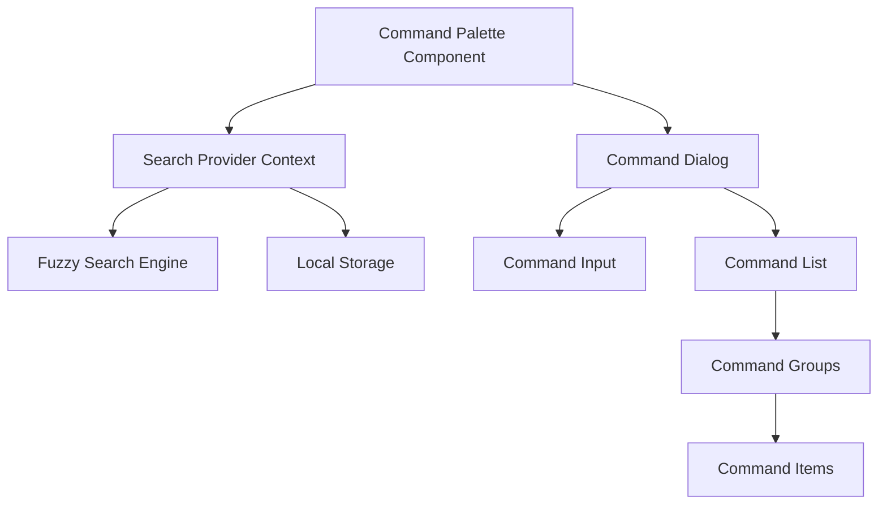
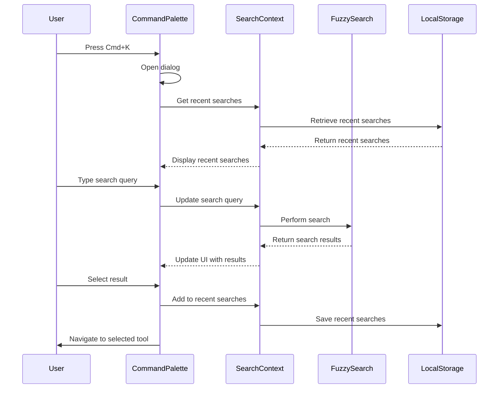

# Design Document: Command Palette

## Overview

The Command Palette will provide a keyboard-accessible search interface for quickly finding and accessing utilities across the braindead.site platform. It will be implemented using the shadcn/ui Command component, enhanced with fuzzy search capabilities and optimized for both desktop and mobile experiences.

The design focuses on speed, accessibility, and user experience, allowing users to quickly find tools without navigating through traditional menus. The Command Palette will support keyboard navigation, recent searches, categorized results, and full accessibility compliance.

## Architecture

The Command Palette will be implemented as a React component that can be accessed globally throughout the application. It will use a combination of local state for UI interactions and persistent storage for saving user preferences and recent searches.

### High-Level Components



### Data Flow



## Components and Interfaces

### 1. SearchProvider Context

The SearchProvider will be a React context that manages the global state for search functionality across the application.

```typescript
// ~/lib/search-context.tsx
import { createContext, useContext, useState, useEffect, ReactNode } from "react";
import Fuse from "fuse.js";
import { Utility } from "~/types";

interface SearchContextType {
  query: string;
  setQuery: (query: string) => void;
  results: Utility[];
  recentSearches: string[];
  addRecentSearch: (query: string) => void;
  clearRecentSearches: () => void;
  isOpen: boolean;
  setIsOpen: (isOpen: boolean) => void;
}

export const SearchContext = createContext<SearchContextType | undefined>(undefined);

export function SearchProvider({ children, utilities }: { children: ReactNode; utilities: Utility[] }) {
  // Implementation details
}

export function useSearch() {
  const context = useContext(SearchContext);
  if (context === undefined) {
    throw new Error("useSearch must be used within a SearchProvider");
  }
  return context;
}
```

### 2. Command Palette Component

The main component that renders the command palette interface.

```typescript
// ~/components/command-palette.tsx
import {
  Command,
  CommandDialog,
  CommandEmpty,
  CommandGroup,
  CommandInput,
  CommandItem,
  CommandList,
  CommandSeparator,
} from "~/components/ui/command";
import { useSearch } from "~/lib/search-context";
import { useEffect } from "react";
import { useNavigate } from "react-router-dom";

export function CommandPalette() {
  // Implementation details
}
```

### 3. Utility Type Definition

```typescript
// ~/types/index.ts
export interface Utility {
  id: string;
  name: string;
  description: string;
  category: string;
  tags: string[];
  path: string;
  icon?: React.ComponentType<{ className?: string }>;
}
```

### 4. Search Button Component

A component that displays a button to open the command palette on mobile devices.

```typescript
// ~/components/search-button.tsx
import { Button } from "~/components/ui/button";
import { Search } from "lucide-react";
import { useSearch } from "~/lib/search-context";

export function SearchButton() {
  // Implementation details
}
```

## Data Models

### Utility Data Model

```typescript
interface Utility {
  id: string;           // Unique identifier for the utility
  name: string;         // Display name of the utility
  description: string;  // Short description of what the utility does
  category: string;     // Category the utility belongs to (e.g., "Text Tools")
  tags: string[];       // Keywords for improved search
  path: string;         // Route path to the utility
  icon?: React.ComponentType<{ className?: string }>; // Optional icon component
}
```

### Recent Searches Model

Recent searches will be stored in localStorage as a simple array of strings:

```typescript
type RecentSearches = string[]; // Limited to 5 items
```

### Search Results Model

```typescript
interface SearchResult {
  item: Utility;
  refIndex: number;
  score: number; // Lower is better match
}

type SearchResults = SearchResult[];
```

## User Interface Design

### Command Palette Dialog

The command palette will be implemented as a modal dialog that appears in the center of the screen when triggered. It will have the following components:

1. **Search Input**: A text input field that automatically receives focus when the palette opens
2. **Results List**: A scrollable list of search results grouped by categories
3. **Empty State**: A message displayed when no results match the search query
4. **Recent Searches**: A list of recently used tools displayed when no search query is entered
5. **Keyboard Navigation**: Visual indicators for keyboard navigation through results

### Mobile Design Considerations

On mobile devices:
- The command palette will be accessible via a search button in the header
- The dialog will take up more screen space to accommodate touch interactions
- Touch targets will be appropriately sized (minimum 44px)
- A clear close button will be provided for easy dismissal

### Visual Design

The command palette will follow the shadcn/ui design system with the following characteristics:
- Clean, minimal interface with appropriate spacing
- Clear visual hierarchy with category headers
- Consistent with the overall application design
- Support for both light and dark themes
- Visual feedback for interactions (hover, focus, selection)

## Error Handling

### Potential Error Scenarios

1. **No Search Results**: Display a friendly "No results found" message with suggestions
2. **Local Storage Unavailable**: Gracefully degrade by not showing recent searches
3. **Keyboard Shortcut Conflicts**: Provide alternative access methods (search button)
4. **Performance Issues with Large Data Sets**: Implement pagination or virtualization for large result sets

### Error Prevention

1. **Input Validation**: Sanitize search input to prevent XSS attacks
2. **Debounce Search**: Prevent excessive search operations during rapid typing
3. **Graceful Degradation**: Ensure basic functionality works without JavaScript
4. **Fallback Mechanisms**: Provide alternative navigation methods if command palette is unavailable

## Testing Strategy

### Unit Tests

1. **SearchProvider Context**:
   - Test state management functions
   - Test search functionality
   - Test recent searches management

2. **Command Palette Component**:
   - Test rendering with different states (empty, with results, with recent searches)
   - Test keyboard navigation
   - Test result selection

### Integration Tests

1. **Keyboard Shortcuts**:
   - Test Cmd+K/Ctrl+K shortcut opens the palette
   - Test Escape key closes the palette
   - Test arrow key navigation through results

2. **Search Functionality**:
   - Test search across different utility properties
   - Test fuzzy matching capabilities
   - Test result highlighting

### Accessibility Tests

1. **Screen Reader Compatibility**:
   - Test with popular screen readers (NVDA, VoiceOver)
   - Verify proper ARIA attributes and announcements

2. **Keyboard Navigation**:
   - Test complete keyboard accessibility
   - Verify focus management within the palette

3. **Visual Accessibility**:
   - Test color contrast compliance
   - Test with different font sizes
   - Test with reduced motion preferences

### Performance Tests

1. **Search Response Time**:
   - Measure time from input to results display
   - Ensure sub-100ms response for typical searches

2. **Rendering Performance**:
   - Test with large result sets
   - Measure frame rates during animations

## Implementation Considerations

### Performance Optimizations

1. **Debounced Search**: Delay search execution during typing to prevent excessive operations
2. **Memoized Results**: Cache search results to prevent unnecessary re-renders
3. **Virtualized Lists**: For large result sets, implement virtualization to render only visible items
4. **Code Splitting**: Load the command palette component only when needed

### Accessibility Considerations

1. **Keyboard Focus Management**: Trap focus within the palette when open
2. **ARIA Attributes**: Use proper ARIA roles, labels, and descriptions
3. **Announcements**: Use live regions to announce dynamic content changes
4. **Reduced Motion**: Respect user preferences for reduced motion

### Mobile Considerations

1. **Touch Targets**: Ensure all interactive elements are at least 44px in size
2. **Viewport Adjustments**: Adapt the palette size and position based on viewport
3. **Virtual Keyboard**: Account for virtual keyboard appearance on mobile devices

### Browser Compatibility

The command palette will be compatible with:
- Chrome, Firefox, Safari, Edge (latest 2 versions)
- iOS Safari, Chrome Mobile, Samsung Internet
- Progressive enhancement for older browsers