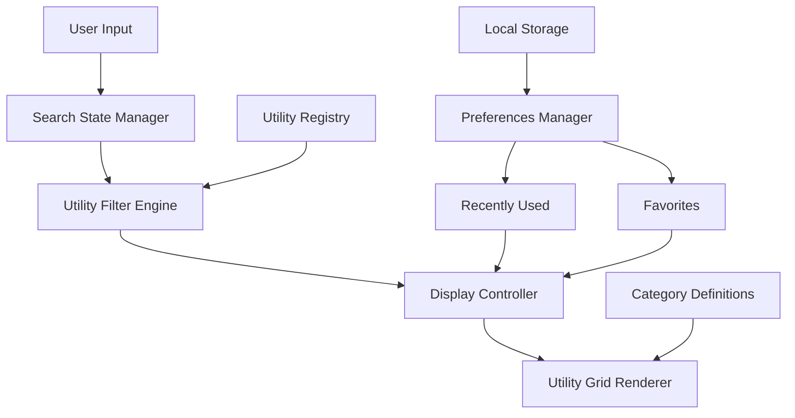

# Design Document

## Overview

The Homepage with Utility Discovery feature transforms braindead.site into an engaging, discoverable platform for web utilities. The design emphasizes personality-driven branding, intuitive search patterns, and scalable utility organization. Built on React Router v7 with server-side rendering, the homepage serves as both an entry point and a navigation hub that grows with the platform.

The design balances professional functionality with approachable personality, using shadcn/ui components and TailwindCSS v4 for consistent theming and accessibility. The architecture supports real-time search, category-based organization, and user personalization while maintaining optimal performance and SEO.

## Architecture

### Component Hierarchy

```
HomePage
├── Header
│   ├── Logo/Branding
│   ├── Navigation (future)
│   └── ThemeToggle
├── HeroSection
│   ├── MainHeadline
│   ├── SubHeadline
│   └── SearchBar
├── UtilityDiscovery
│   ├── SearchResults (conditional)
│   ├── RecentlyUsed (conditional)
│   ├── Favorites (conditional)
│   └── UtilityGrid
│       └── CategorySection[]
│           └── UtilityCard[]
└── Footer
    ├── Links
    └── Credits
```

### Data Flow Architecture



### State Management

- **Search State**: Real-time search query and results using React state
- **Theme State**: Managed by next-themes with localStorage persistence
- **User Preferences**: Local storage for recently used utilities and favorites
- **Utility Registry**: Static configuration for available utilities and metadata

## Components and Interfaces

### Core Components

#### HomePage Component
```typescript
interface HomePageProps {
  utilities: UtilityDefinition[];
  categories: CategoryDefinition[];
}

interface UtilityDefinition {
  id: string;
  name: string;
  description: string;
  category: CategoryType;
  keywords: string[];
  route: string;
  icon?: string;
  featured?: boolean;
}

interface CategoryDefinition {
  id: CategoryType;
  name: string;
  description: string;
  color: string;
  icon: string;
}
```

#### SearchBar Component
```typescript
interface SearchBarProps {
  onSearch: (query: string) => void;
  placeholder?: string;
  suggestions?: SearchSuggestion[];
}

interface SearchSuggestion {
  type: 'utility' | 'category' | 'keyword';
  text: string;
  utility?: UtilityDefinition;
}
```

#### UtilityCard Component
```typescript
interface UtilityCardProps {
  utility: UtilityDefinition;
  variant?: 'default' | 'compact' | 'featured';
  onClick?: () => void;
}
```

#### CategorySection Component
```typescript
interface CategorySectionProps {
  category: CategoryDefinition;
  utilities: UtilityDefinition[];
  maxItems?: number;
  showViewAll?: boolean;
}
```

### Search Engine Interface

```typescript
interface SearchEngine {
  search(query: string): SearchResult[];
  getSuggestions(query: string): SearchSuggestion[];
  addToRecentlyUsed(utilityId: string): void;
  toggleFavorite(utilityId: string): void;
}

interface SearchResult {
  utility: UtilityDefinition;
  relevanceScore: number;
  matchedFields: string[];
}
```

### Preferences Manager Interface

```typescript
interface PreferencesManager {
  getRecentlyUsed(): string[];
  getFavorites(): string[];
  addRecentlyUsed(utilityId: string): void;
  toggleFavorite(utilityId: string): void;
  clearHistory(): void;
}
```

## Data Models

### Utility Registry Schema

```typescript
type CategoryType = 'text' | 'developer' | 'image' | 'productivity' | 'fun';

interface UtilityRegistry {
  categories: Record<CategoryType, CategoryDefinition>;
  utilities: UtilityDefinition[];
  featured: string[];
}

// Example utility definition
const exampleUtility: UtilityDefinition = {
  id: 'base64-encoder',
  name: 'Base64 Encoder/Decoder',
  description: 'Encode and decode Base64 strings',
  category: 'developer',
  keywords: ['base64', 'encode', 'decode', 'conversion'],
  route: '/tools/base64',
  icon: 'Code2',
  featured: true
};
```

### Search Index Structure

```typescript
interface SearchIndex {
  utilities: Map<string, UtilityDefinition>;
  keywords: Map<string, string[]>; // keyword -> utility IDs
  categories: Map<CategoryType, string[]>; // category -> utility IDs
  fuzzyMatcher: FuzzyMatcher;
}
```

### User Preferences Schema

```typescript
interface UserPreferences {
  recentlyUsed: {
    utilityId: string;
    timestamp: number;
  }[];
  favorites: string[];
  theme: 'light' | 'dark' | 'system';
  searchHistory: string[];
}
```

## Error Handling

### Search Error States

- **No Results Found**: Display helpful suggestions and popular utilities
- **Search Service Unavailable**: Graceful degradation to static utility grid
- **Invalid Search Query**: Handle special characters and provide feedback

### Data Loading Error States

- **Utility Registry Load Failure**: Show cached utilities or basic fallback
- **Preferences Load Failure**: Continue with default preferences
- **Theme Load Failure**: Default to system theme

### Network Error Handling

- **Offline State**: Show cached utilities with offline indicator
- **Slow Connection**: Progressive loading with skeleton states
- **Failed Navigation**: Provide fallback routes and error boundaries

### Error Recovery Patterns

```typescript
interface ErrorBoundaryState {
  hasError: boolean;
  errorType: 'search' | 'data' | 'network' | 'unknown';
  fallbackComponent: React.ComponentType;
}

// Error recovery strategies
const errorRecoveryStrategies = {
  search: () => showStaticUtilities(),
  data: () => loadCachedData(),
  network: () => enableOfflineMode(),
  unknown: () => showGenericError()
};
```

## Testing Strategy

### Unit Testing

**Component Testing**
- SearchBar: Input handling, suggestion display, keyboard navigation
- UtilityCard: Rendering variants, click handling, accessibility
- CategorySection: Utility filtering, responsive layout
- PreferencesManager: Local storage operations, data persistence

**Service Testing**
- SearchEngine: Query processing, relevance scoring, fuzzy matching
- UtilityRegistry: Data validation, category organization
- Theme management: Persistence, system preference detection

### Integration Testing

**Search Flow Testing**
- End-to-end search functionality from input to results
- Search suggestion generation and selection
- Search result navigation and utility access

**Personalization Testing**
- Recently used utilities tracking and display
- Favorites management and persistence
- Preference synchronization across sessions

**Theme Integration Testing**
- Theme switching across all components
- Persistence across page reloads
- System theme preference detection

### Accessibility Testing

**Keyboard Navigation**
- Tab order through search, utilities, and navigation
- Arrow key navigation in search suggestions
- Enter/Space activation of utility cards

**Screen Reader Testing**
- Proper ARIA labels for search functionality
- Semantic heading structure and landmarks
- Live region announcements for search results

**Visual Accessibility**
- Color contrast validation for all theme combinations
- Focus indicator visibility and consistency
- Text scaling and responsive behavior

### Performance Testing

**Core Web Vitals**
- Largest Contentful Paint (LCP) < 2.5s
- First Input Delay (FID) < 100ms
- Cumulative Layout Shift (CLS) < 0.1

**Search Performance**
- Search response time < 100ms for typical queries
- Suggestion generation < 50ms
- Utility filtering performance with large datasets

**Loading Performance**
- Initial page load optimization
- Progressive enhancement for JavaScript features
- Image and asset optimization

### SEO Testing

**Meta Tag Validation**
- Dynamic meta tag generation
- Open Graph and Twitter Card data
- Structured data markup validation

**Content Accessibility**
- Server-side rendering verification
- Content availability without JavaScript
- Proper URL structure and canonical tags