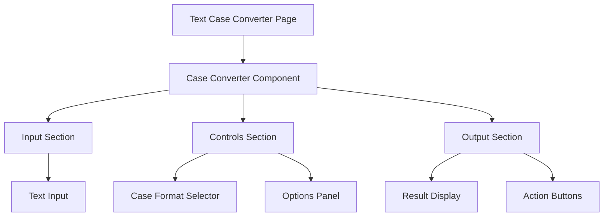
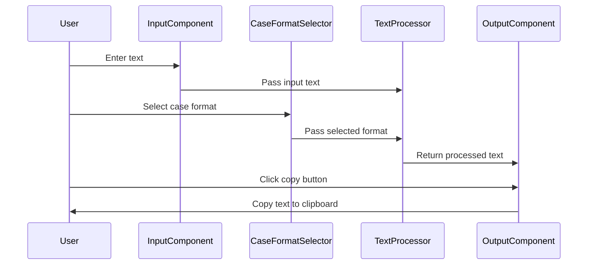

# Design Document: Text Case Converter

## Overview

The Text Case Converter is a utility tool that allows users to transform text between different case formats. It provides a clean, intuitive interface with real-time conversion and support for multiple case formats. The tool is designed to be accessible, responsive, and performant across all devices.

This document outlines the design decisions, architecture, and implementation details for the Text Case Converter utility.

## Architecture

The Text Case Converter will be implemented as a client-side React component with no backend dependencies. All text processing will happen in the browser to ensure privacy and performance.

### High-Level Components



### Data Flow



## Components and Interfaces

### 1. TextCaseConverterPage

The main page component that hosts the case converter tool.

```typescript
// ~/routes/tools/text/case-converter.tsx
import { TextCaseConverter } from "~/components/tools/text-case-converter/TextCaseConverter";

export default function TextCaseConverterPage() {
  return (
    <div className="container py-8">
      <h1 className="text-3xl font-bold mb-2">Text Case Converter</h1>
      <p className="text-muted-foreground mb-6">
        Convert text between different case formats
      </p>
      
      <TextCaseConverter />
    </div>
  );
}

export const meta = () => {
  return [
    { title: "Text Case Converter | braindead.site" },
    { name: "description", content: "Convert text between different case formats including uppercase, lowercase, title case, camelCase, snake_case, and more." },
  ];
};
```

### 2. TextCaseConverter Component

The main component that manages the state and orchestrates the conversion process.

```typescript
// ~/components/tools/text-case-converter/TextCaseConverter.tsx
import { useState, useEffect } from "react";
import { TextInput } from "./TextInput";
import { CaseFormatSelector } from "./CaseFormatSelector";
import { TextOutput } from "./TextOutput";
import { OptionsPanel } from "./OptionsPanel";
import { CaseFormat, ConversionOptions } from "./types";
import { convertCase } from "./case-converter";

export function TextCaseConverter() {
  // Implementation details
}
```

### 3. Case Converter Service

A utility service that handles the actual text transformation logic.

```typescript
// ~/components/tools/text-case-converter/case-converter.ts
import { CaseFormat, ConversionOptions } from "./types";

/**
 * Convert text to the specified case format
 */
export function convertCase(
  text: string,
  format: CaseFormat,
  options: ConversionOptions = {}
): string {
  // Implementation details
}
```

### 4. Types Definition

```typescript
// ~/components/tools/text-case-converter/types.ts
/**
 * Available case formats
 */
export enum CaseFormat {
  UPPER = "UPPERCASE",
  LOWER = "lowercase",
  TITLE = "Title Case",
  SENTENCE = "Sentence case",
  CAMEL = "camelCase",
  PASCAL = "PascalCase",
  SNAKE = "snake_case",
  KEBAB = "kebab-case",
  CONSTANT = "CONSTANT_CASE",
}

/**
 * Options for text conversion
 */
export interface ConversionOptions {
  /** Whether to preserve acronyms in title and sentence case */
  preserveAcronyms?: boolean;
  /** Custom words to always capitalize (e.g., proper nouns) */
  alwaysCapitalize?: string[];
  /** Custom words to never capitalize (e.g., brand names like "iPhone") */
  neverCapitalize?: string[];
}
```

## Data Models

### Case Format Model

```typescript
interface CaseFormatInfo {
  id: CaseFormat;
  label: string;
  description: string;
  example: string;
}

const CASE_FORMATS: CaseFormatInfo[] = [
  {
    id: CaseFormat.UPPER,
    label: "UPPERCASE",
    description: "All characters in uppercase",
    example: "EXAMPLE TEXT",
  },
  {
    id: CaseFormat.LOWER,
    label: "lowercase",
    description: "All characters in lowercase",
    example: "example text",
  },
  {
    id: CaseFormat.TITLE,
    label: "Title Case",
    description: "First letter of each word capitalized",
    example: "Example Text",
  },
  {
    id: CaseFormat.SENTENCE,
    label: "Sentence case",
    description: "First letter of each sentence capitalized",
    example: "Example text",
  },
  {
    id: CaseFormat.CAMEL,
    label: "camelCase",
    description: "No spaces, first letter lowercase, subsequent words capitalized",
    example: "exampleText",
  },
  {
    id: CaseFormat.PASCAL,
    label: "PascalCase",
    description: "No spaces, all words capitalized",
    example: "ExampleText",
  },
  {
    id: CaseFormat.SNAKE,
    label: "snake_case",
    description: "All lowercase with underscores between words",
    example: "example_text",
  },
  {
    id: CaseFormat.KEBAB,
    label: "kebab-case",
    description: "All lowercase with hyphens between words",
    example: "example-text",
  },
  {
    id: CaseFormat.CONSTANT,
    label: "CONSTANT_CASE",
    description: "All uppercase with underscores between words",
    example: "EXAMPLE_TEXT",
  },
];
```

### Conversion Options Model

```typescript
interface ConversionOptionsState {
  preserveAcronyms: boolean;
  alwaysCapitalize: string[];
  neverCapitalize: string[];
}

const DEFAULT_OPTIONS: ConversionOptionsState = {
  preserveAcronyms: true,
  alwaysCapitalize: [],
  neverCapitalize: [],
};
```

## User Interface Design

### Layout

The Text Case Converter will have a clean, focused layout with three main sections:

1. **Input Section**: A textarea for entering the text to convert
2. **Controls Section**: Options for selecting the case format and additional settings
3. **Output Section**: A display area for the converted text with action buttons

### Mobile Design Considerations

On mobile devices:
- The layout will stack vertically
- The input and output areas will be sized appropriately for mobile screens
- Touch targets will be at least 44px in size
- The virtual keyboard will not obscure important UI elements

### Visual Design

The tool will follow the shadcn/ui design system with the following characteristics:
- Clean, minimal interface with appropriate spacing
- Clear visual hierarchy
- Consistent with the overall application design
- Support for both light and dark themes
- Visual feedback for interactions (hover, focus, selection)

## Error Handling

### Potential Error Scenarios

1. **Empty Input**: Display a placeholder message in the output area
2. **Very Large Input**: Implement performance optimizations for large text
3. **Clipboard API Unavailable**: Provide alternative instructions for copying
4. **Unsupported Characters**: Handle gracefully with appropriate fallbacks

### Error Prevention

1. **Input Validation**: Sanitize input to prevent XSS attacks
2. **Performance Monitoring**: Debounce input changes for large text
3. **Graceful Degradation**: Ensure basic functionality works without JavaScript
4. **Fallback Mechanisms**: Provide alternative methods for core functionality

## Testing Strategy

### Unit Tests

1. **Case Converter Functions**:
   - Test each case conversion function with various inputs
   - Test edge cases (empty strings, special characters, numbers)
   - Test with different options (preserveAcronyms, etc.)

2. **Component Tests**:
   - Test rendering with different props
   - Test state management
   - Test user interactions

### Integration Tests

1. **End-to-End Flow**:
   - Test the complete user flow from input to output
   - Test case format selection
   - Test copy functionality

2. **Responsive Design**:
   - Test on different viewport sizes
   - Test with different device capabilities

### Accessibility Tests

1. **Screen Reader Compatibility**:
   - Test with popular screen readers (NVDA, VoiceOver)
   - Verify proper ARIA attributes and announcements

2. **Keyboard Navigation**:
   - Test complete keyboard accessibility
   - Verify focus management

3. **Visual Accessibility**:
   - Test color contrast compliance
   - Test with different font sizes
   - Test with reduced motion preferences

## Implementation Considerations

### Performance Optimizations

1. **Debounced Input**: Delay processing for large text inputs
2. **Memoized Results**: Cache conversion results to prevent unnecessary re-computation
3. **Virtualization**: For very large text, consider virtualizing the output display

### Accessibility Considerations

1. **Keyboard Focus Management**: Ensure logical tab order
2. **ARIA Attributes**: Use proper ARIA roles, labels, and descriptions
3. **Announcements**: Use live regions to announce dynamic content changes
4. **Reduced Motion**: Respect user preferences for reduced motion

### Browser Compatibility

The Text Case Converter will be compatible with:
- Chrome, Firefox, Safari, Edge (latest 2 versions)
- iOS Safari, Chrome Mobile, Samsung Internet
- Progressive enhancement for older browsers