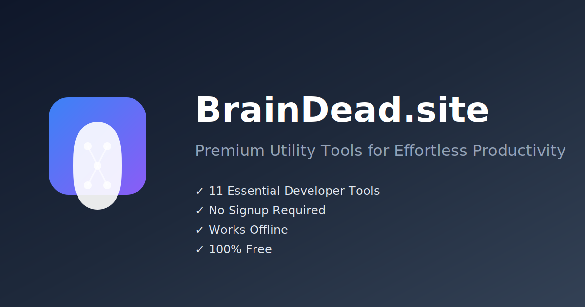

# BrainDead.site - Production Ready Utility Tools



A comprehensive collection of utility tools built with React, TypeScript, and Vite. Production-ready with enterprise-grade monitoring, security, and performance optimizations.

## 🚀 Features

- **Calculator** with history and advanced operations
- **Color Picker** with palette generation
- **QR Code Generator** with customization options
- **Text Tools** for transformation and analysis
- **Password Generator** with strength validation
- **Hash Generator** supporting multiple algorithms
- **Image Optimizer** with compression and format conversion
- **Timestamp Converter** for date/time utilities
- **JSON Formatter** with validation and beautification
- **Random Data Generator** for testing and development
- **Unit Converter** for various measurement types

## 🏗️ Production Architecture

### Security
- ✅ Content Security Policy (CSP) headers
- ✅ XSS protection and input sanitization
- ✅ Rate limiting for resource-intensive operations
- ✅ Comprehensive error boundary with reporting
- ✅ Security headers via Nginx configuration

### Performance
- ✅ Code splitting and lazy loading
- ✅ Bundle optimization with manual chunks
- ✅ Tree shaking and dead code elimination
- ✅ Gzip compression and asset optimization
- ✅ Service Worker for offline functionality
- ✅ Performance monitoring and Web Vitals tracking

### SEO & Accessibility
- ✅ Comprehensive meta tags and Open Graph
- ✅ Structured data (JSON-LD)
- ✅ PWA manifest with proper icons
- ✅ Semantic HTML and ARIA attributes
- ✅ Sitemap and robots.txt

### Monitoring & Analytics
- ✅ Error reporting and logging system
- ✅ Performance metrics collection
- ✅ Health checks for critical APIs
- ✅ User analytics and event tracking

## 🛠️ Tech Stack

- **Frontend**: React 18, TypeScript, Tailwind CSS
- **Build Tool**: Vite with optimized configuration
- **Testing**: Vitest with comprehensive test coverage
- **Linting**: ESLint with TypeScript rules
- **Deployment**: Docker with Nginx
- **CI/CD**: GitHub Actions pipeline

## 📦 Installation

```bash
# Install dependencies
npm install

# Fix security vulnerabilities
npm audit fix

# Start development server
npm run dev

# Run tests
npm run test

# Build for production
npm run build:prod

# Preview production build
npm run preview
```

## 🔧 Development Scripts

```bash
npm run dev              # Start development server
npm run build            # Build for production
npm run build:prod       # Build with production optimizations
npm run build:analyze    # Build and analyze bundle size
npm run lint             # Run ESLint
npm run lint:fix         # Fix ESLint issues
npm run type-check       # Run TypeScript type checking
npm run test             # Run tests
npm run test:coverage    # Run tests with coverage
npm run test:ui          # Run tests with UI
npm run pre-commit       # Run all checks (lint, type-check, test)
npm run security-audit   # Check for security vulnerabilities
```

## 🚀 Netlify Deployment

### Quick Deploy Options:

#### Option 1: Drag & Drop (Easiest)
```bash
npm run build
# Drag the 'dist' folder to netlify.com
```

#### Option 2: Automated Script
```bash
# Windows
./deploy.bat

# Linux/Mac
./deploy.sh
```

#### Option 3: Netlify CLI
```bash
npm install -g netlify-cli
netlify login
npm run deploy
```

### Build Configuration:
- **Build command**: `npm run build`
- **Publish directory**: `dist`
- **Node version**: `18`

## 🐳 Docker Deployment

```bash
# Build Docker image
docker build -t braindead-site .

# Run container
docker run -p 80:80 braindead-site

# Health check
curl http://localhost/health
```

## 🔒 Environment Variables

Create a `.env` file with the following variables:

```env
# Application
VITE_APP_VERSION=1.0.0
VITE_APP_NAME=BrainDead.site
VITE_APP_URL=https://braindead.site

# Analytics (replace with your service)
VITE_ANALYTICS_ID=your-analytics-id
VITE_ANALYTICS_ENABLED=true

# Error Reporting (replace with your service)
VITE_ERROR_REPORTING_DSN=your-error-reporting-dsn
VITE_ERROR_REPORTING_ENABLED=true

# Feature Flags
VITE_ENABLE_ANALYTICS=true
VITE_ENABLE_ERROR_REPORTING=true
VITE_ENABLE_RATE_LIMITING=true

# Production Settings
VITE_DEBUG_MODE=false
VITE_LOG_LEVEL=warn
```

## 📊 Monitoring

The application includes comprehensive monitoring:

- **Health Checks**: `/health` endpoint for load balancer checks
- **Performance Metrics**: Core Web Vitals tracking
- **Error Reporting**: Automatic error capture and reporting
- **Analytics**: User behavior and feature usage tracking

Access monitoring data:
```javascript
import { getHealthStatus, getPerformanceMetrics } from './src/utils/monitoring';

console.log(getHealthStatus());
console.log(getPerformanceMetrics());
```

## 🔧 Configuration

### Nginx Configuration
The included `nginx.conf` provides:
- Gzip compression
- Security headers
- Static asset caching
- SPA routing support
- Health check endpoint

### Service Worker
Automatic caching strategy:
- Static assets cached for 1 year
- HTML cached for 1 hour
- Dynamic content cached with network-first strategy
- Offline fallback support

## 🧪 Testing

Comprehensive test suite with:
- Unit tests for all utilities
- Component testing with React Testing Library
- Coverage reporting
- Mock implementations for browser APIs

```bash
# Run all tests
npm run test

# Run tests with coverage
npm run test:coverage

# Run tests in watch mode
npm run test:watch

# Run tests with UI
npm run test:ui
```

## 📈 Performance Optimization

- **Bundle Size**: Optimized with code splitting and tree shaking
- **Loading Speed**: Lazy loading and resource preloading
- **Runtime Performance**: Memoization and efficient algorithms
- **Caching Strategy**: Service Worker with intelligent caching
- **Image Optimization**: SVG icons and optimized assets

## 🔐 Security Features

- **Input Validation**: Comprehensive sanitization and validation
- **Rate Limiting**: Protection against abuse
- **CSP Headers**: Strict content security policy
- **XSS Protection**: Multiple layers of XSS prevention
- **Error Handling**: Secure error reporting without data leakage

## 🌐 PWA Features

- **Offline Support**: Service Worker with caching
- **App-like Experience**: Standalone display mode
- **Cross-platform Icons**: Comprehensive icon set
- **Responsive Design**: Works on all device sizes
- **Fast Loading**: Optimized for mobile networks

## 📱 Browser Support

- Chrome/Edge 88+
- Firefox 85+
- Safari 14+
- Mobile browsers with ES2020 support

## 🤝 Contributing

1. Fork the repository
2. Create a feature branch
3. Run `npm run pre-commit` to ensure code quality
4. Submit a pull request

## 📄 License

MIT License - see LICENSE file for details

## 🔗 Links

- **Live Site**: https://braindead.site
- **Documentation**: [Wiki](https://github.com/your-repo/wiki)
- **Issues**: [GitHub Issues](https://github.com/your-repo/issues)
- **Security**: security@braindead.site

---

Built with ❤️ for developers who value effortless productivity.